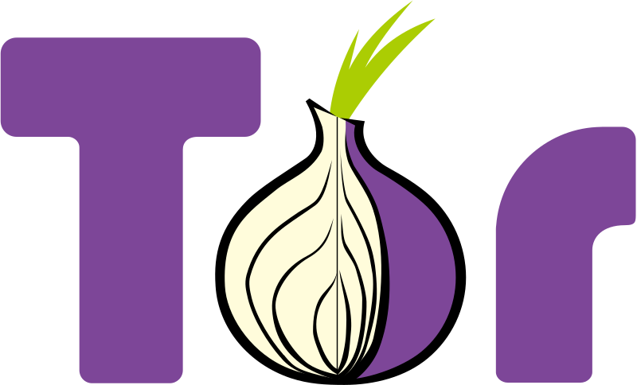
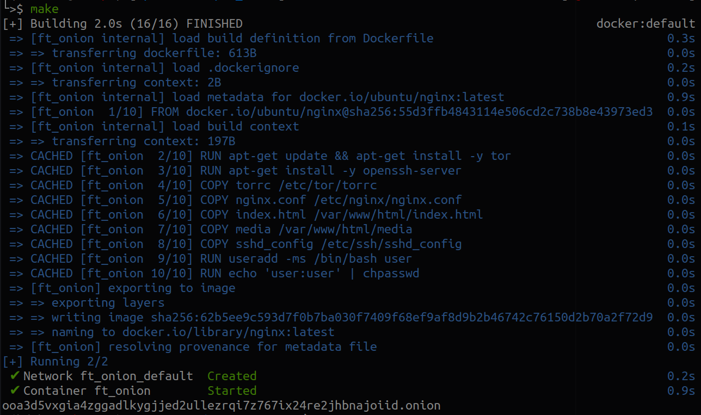
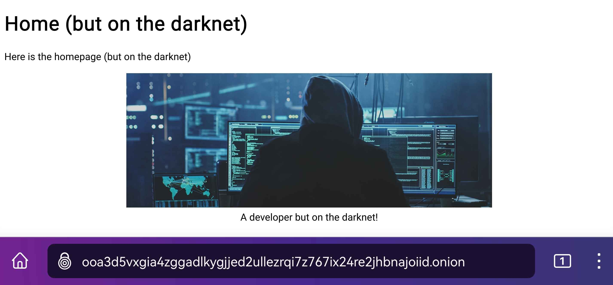

<div id="top"></div>

<div align="center">
 <a href="https://github.com/Link-Wolf/ft_onion" title="Go to GitHub repo"></a>
 <a href="https://"></a>
 <a href="https://"></a>
 <a href="https://github.com/Link-Wolf/ft_onion/stargazers"></a>
 <a href="https://github.com/Link-Wolf/ft_onion/network/members"></a>
 <a href="https://github.com/Link-Wolf/ft_onion/issues"></a>
 <a href="https://www.apple.com/macos/" title="Go to Apple homepage"></a>
</div>

<!-- PROJECT LOGO -->
<br />
<div align="center">
  <a>
    
  </a>

  <h3 align="center">Piscine Cybersecurity - ft_onion</h3>

  <p align="center">
   <em>Unleash the power of anonymity on the Internet!</em><br/>
    A web server that shows a webpage on the Tor network 
    <br />
    <br />
    <a href="https://github.com/Link-Wolf/ft_onion/issues">Report Bug</a>
    ·
    <a href="https://github.com/Link-Wolf/ft_onion/issues">Request Feature</a>
  </p>
</div>

<!-- TABLE OF CONTENTS -->
<details>
  <summary>Table of Contents</summary>
  <ol>
    <li>
      <a href="#goal">Goal</a>
    </li>
    <li>
      <a href="#getting-started">Getting Started</a>
      <ul>
        <li><a href="#prerequisites">Prerequisites</a></li>
        <li><a href="#installation">Installation</a></li>
      </ul>
    </li>
    <li><a href="#usage">Usage</a></li>
    <li><a href="#contributing">Contributing</a></li>
    <li><a href="#contact">Contact</a></li>
  </ol>
</details>

<!-- GOAL -->

## Goal

<div align="center">
  <a>
	
  </a>
</div>
</br>

This cybersecurity project aims to create a basic web application accessible from the Tor network by creating a `hidden service`.
It has to run on a Docker container and be accessible through a url of the type xxxxxxxxxxxxx.onion.
Nginx is used to configure the web server.
The port 80 must be enabled to access the static page via HTTP and the port 4242 must be enabled to access the server using SSH.

<p align="right">(<a href="#top">back to top</a>)</p>

<!-- GETTING STARTED -->

## Getting Started

### Prerequisites

Having [Docker](https://docker.com) installed on your system and be able to run the `docker compose` command on your system

### Installation

1. Clone the repo

    ```sh
    $> git clone https://github.com/Link-Wolf/ft_onion.git
    ```

2. Launch the docker container

    ```sh
    $> cd ft_onion
    $> make
    ```

<p align="right">(<a href="#top">back to top</a>)</p>

<!-- USAGE EXAMPLES -->

## Usage examples





<p align="right">(<a href="#top">back to top</a>)</p>

<!-- CONTRIBUTING -->

## Contributing

If you have a suggestion that would make this better, please fork the repo and create a pull request. You can also simply open an issue with the tag "enhancement".
Don't forget to give the project a star! Thanks again!

1. Fork the Project
2. Create your Feature Branch (`git checkout -b feature/AmazingFeature`)
3. Commit your Changes (`git commit -m 'Add some AmazingFeature'`)
4. Push to the Branch (`git push origin feature/AmazingFeature`)
5. Open a Pull Request

<p align="right">(<a href="#top">back to top</a>)</p>

<!-- CONTACT -->

## Contact

Mail : xxxxxxx@student.42mulhouse.fr

Project Link: [https://github.com/Link-Wolf/ft_onion](https://github.com/Link-Wolf/ft_onion)

<p align="right">(<a href="#top">back to top</a>)</p>
